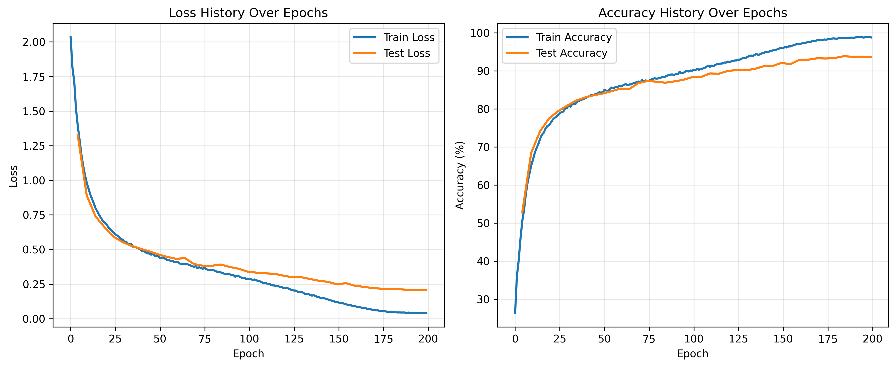
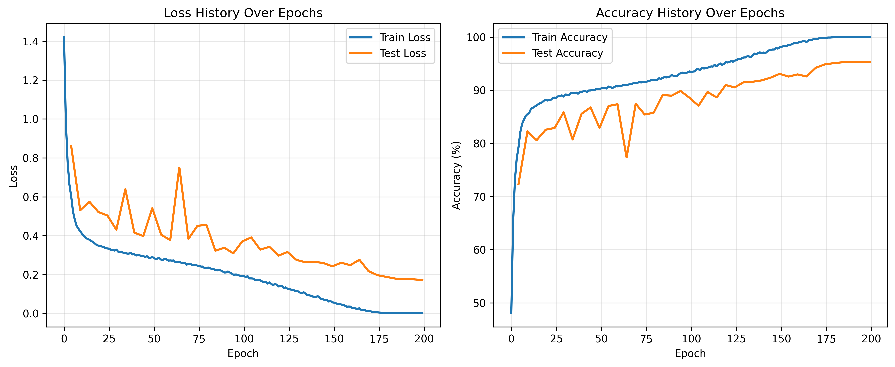

# ResNet-18: JAX vs PyTorch TPU Training Comparison

This repository implements ResNet-18 for [CIFAR-10](https://www.cs.toronto.edu/~kriz/cifar.html) classification in both **JAX/Flax** and **PyTorch** optimized for **TPU v6 lite** training. 

## **What & Why**

Hands-on exploration comparing JAX's functional programming approach ([jit](https://docs.jax.dev/en/latest/jit-compilation.html), [pmap](https://docs.jax.dev/en/latest/parallel-evaluation.html), [vmap](https://docs.jax.dev/en/latest/automatic-vectorization.html)) vs PyTorch's imperative style through identical [ResNet-18](https://arxiv.org/pdf/1512.03385) architectures, training protocols, and TPU optimizations.

## **Training Results**

Both implementations achieve convergence on CIFAR-10 with optimized TPU training:

### JAX/Flax Results


### PyTorch Results  


## **ResNet-18 Architecture**

Following the [torchvision](https://github.com/pytorch/vision/blob/main/torchvision/models/resnet.py) implementation of `resnet18`:

**Input**: `(N, 3, 32, 32)`

**Stem**
| Operation | Details | Output Shape |
| :--- | :--- | :--- |
| **Conv3x3** | S=1, Out=64 | (N, 64, 32, 32) |
| BN + ReLU | Batch Normalization + Activation | (N, 64, 32, 32) |

**Layer 1-4 (2 BasicBlocks each)**
| Layer | Details | Output Shape |
| :--- | :--- | :--- |
| **Layer 1** | 2×BasicBlock, S=1, Out=64 | (N, 64, 32, 32) |
| **Layer 2** | 2×BasicBlock, S=2→1, Out=128, Downsample | (N, 128, 16, 16) |
| **Layer 3** | 2×BasicBlock, S=2→1, Out=256, Downsample | (N, 256, 8, 8) |
| **Layer 4** | 2×BasicBlock, S=2→1, Out=512, Downsample | (N, 512, 4, 4) |

**Head**
| Operation | Details | Output Shape |
| :--- | :--- | :--- |
| **AvgPool** | Global Average Pooling (4×4→1×1) | (N, 512, 1, 1) |
| **Linear** | 512 → num_classes | (N, 10) |

*BasicBlock*: Two 3×3 Conv layers with BN+ReLU plus identity shortcut connection.

## **Quick Start**

### **JAX/Flax TPU Training**
```bash
# Optimized JAX training 
python train_jax_tpu.py

```

### **PyTorch TPU Training**
```bash
# Standard PyTorch TPU training
python train_pytorch_tpu.py

# Optimized with mixed precision & compilation
python train_pytorch_tpu_optimized.py
```

##  **Key Optimizations Implemented**

### **JAX Optimizations**
- **Pre-compiled pmap**: Eliminates jit-of-pmap overhead (~260x speedup)
- **Streaming data loader**: Async CPU preprocessing with multi-threading
- **Proper batch statistics**: Fixed BatchNorm evaluation for multi-device training
- **Orbax checkpointing**: Robust model saving with API compatibility

### **PyTorch Optimizations**
- **Mixed precision (AMP)**: 1.5-2x faster training with reduced memory usage
- **Model compilation**: OpenXLA backend for 20-40% speedup
- **Optimized data loading**: Persistent workers, efficient batch preparation
- **XLA synchronization**: Periodic `mark_step()` for better performance

## **Code Structure**

```
resnet18_pytorch_jax_tpu/
├── train_jax_tpu.py              # Main JAX training script
├── train_pytorch_tpu.py          # Main PyTorch training script  
├── train_pytorch_tpu_optimized.py # Optimized PyTorch with AMP
├── config/
│   ├── jax_tpu.yaml             # JAX training configuration
│   ├── pytorch_tpu.yaml         # PyTorch training configuration
│   └── pytorch_tpu_optimized.yaml # Optimized PyTorch config
├── models/
│   ├── jax/resnet18.py          # JAX/Flax ResNet-18 implementation
│   └── pytorch/resnet18.py      # PyTorch ResNet-18 implementation
├── training/
│   ├── jax_trainer_tpu.py       # JAX training loop with optimizations
│   ├── pytorch_trainer_tpu.py   # PyTorch training loop
│   └── pytorch_trainer_tpu_optimized.py # Optimized PyTorch trainer
├── utils/
│   ├── jax_utils_optimized.py   # JAX utilities and helpers
│   ├── tpu_utils.py             # PyTorch XLA utilities
│   ├── logging_utils.py         # Shared logging functionality
│   └── plotting.py              # Training visualization
└── logs/                        # Training logs and plots
```

## TPU Usage
Below are the TPUs I used:
```
(jax101) ➜  resnet18 git:(main) ✗ tpu-info
TPU Chips                                      
┏━━━━━━━━━━━━━┳━━━━━━━━━━━━━━┳━━━━━━━━━┳━━━━━━┓
┃ Chip        ┃ Type         ┃ Devices ┃ PID  ┃
┡━━━━━━━━━━━━━╇━━━━━━━━━━━━━━╇━━━━━━━━━╇━━━━━━┩
│ /dev/vfio/0 │ TPU v6e chip │ 1       │ None │
│ /dev/vfio/1 │ TPU v6e chip │ 1       │ None │
│ /dev/vfio/2 │ TPU v6e chip │ 1       │ None │
│ /dev/vfio/3 │ TPU v6e chip │ 1       │ None │
│ /dev/vfio/4 │ TPU v6e chip │ 1       │ None │
│ /dev/vfio/5 │ TPU v6e chip │ 1       │ None │
│ /dev/vfio/6 │ TPU v6e chip │ 1       │ None │
│ /dev/vfio/7 │ TPU v6e chip │ 1       │ None │
└─────────────┴──────────────┴─────────┴──────┘
```
The JAX ResNet-18 takes < 10 minuetes to finish on 8 v6e TPUs.